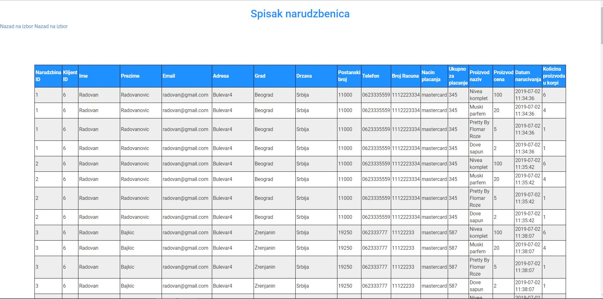

# rofiprofi.github.io
College project website named Kozmolend. Website includes:
•	Login and registration page
•	Home page with the products
•	Cart page in which a customer can delete one product or all products from the cart, edit quantity of the products in the cart and proceed to check page.
•	Check page
•	Admin page in which a admin can see history of orders
Back-end and design of database done by me.
Front-end of the project did colleague of mine.
Note: Project is not completed but all the named functions work.

Screenshots of website:
Login and registration page:

Home page

Cart Page

The check
	

Confirmation of the check:

Admin login:

	

Admin List of orders:

