# rofiprofi.github.io
# Requirement
PHP, mySQL, Apache server, XAMPP

# Installation
1. Clone it
2. Unzip the rar file
3. Copy unzip folder into ''htdocs'' folder
4. Import kozmolend.sql database into phpmyadmin
5. Start it from localhost in your browser
6. Enjoy :)

College project webapp named Kozmolend. Webapp includes:
•	Login and registration page
•	Home page with the products
•	Cart page in which a customer can delete one product or all products from the cart, edit quantity of the products in the cart and proceed to check page.
•	Check page
•	Admin home page in which the admin can CRUD customer's orders, products, categories & users.
Back-end and design of database done by me.
Front-end of the project did colleague of mine.
Note: Project is almost completed but there should be added some triggers for better funcionality of database. :)

Screenshots of webapp:
Login and registration page:
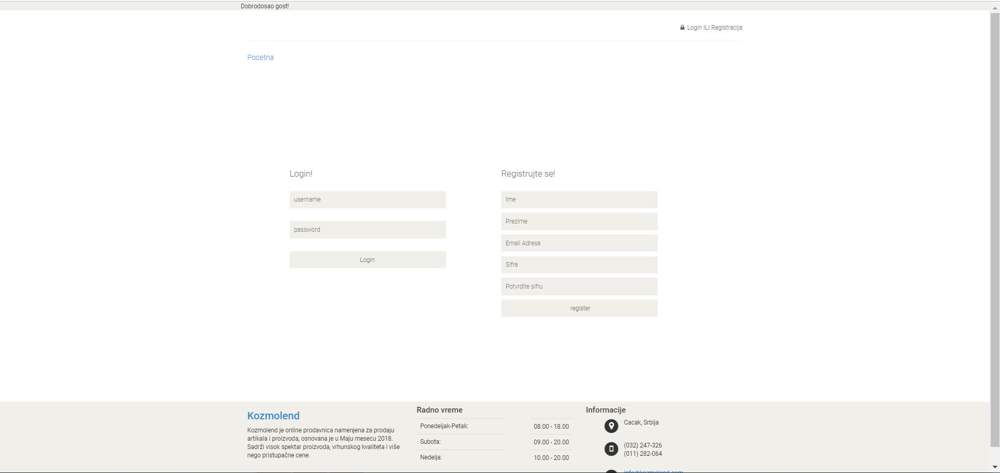

Home page
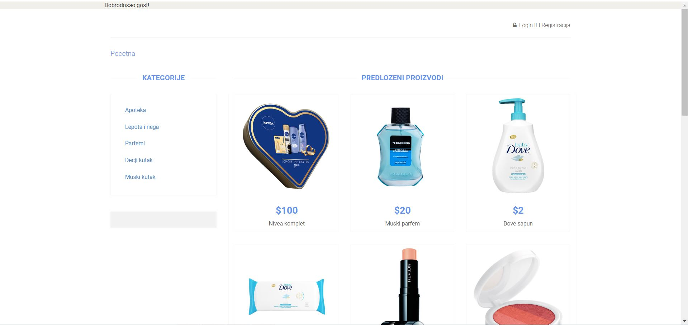

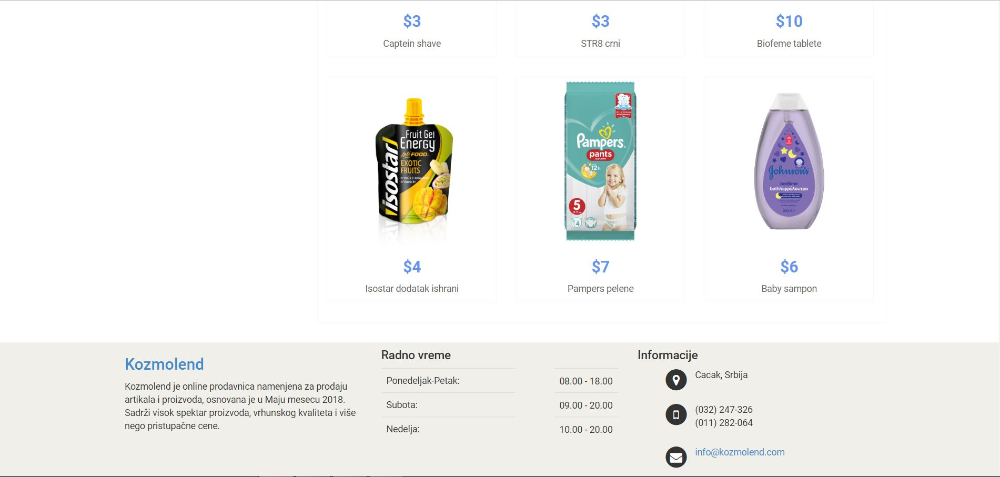

Cart Page

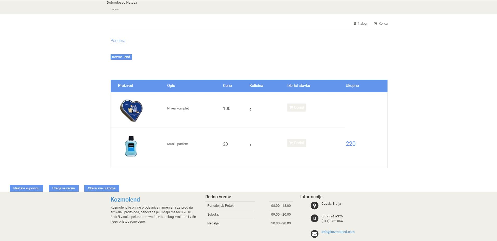

The check
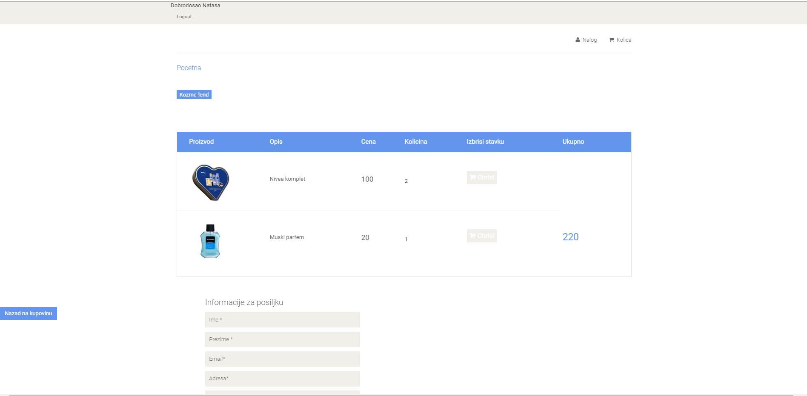	
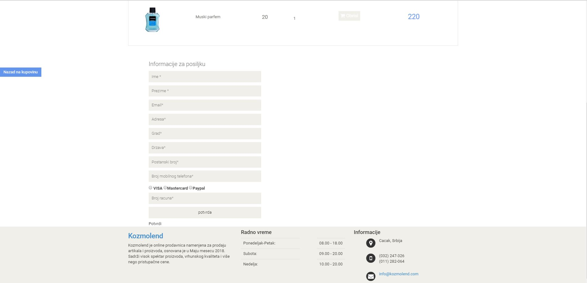
Confirmation of the check:
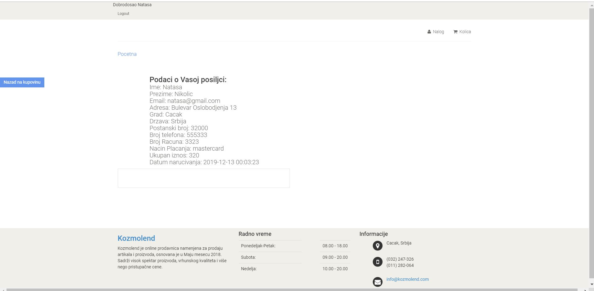

Admin login:

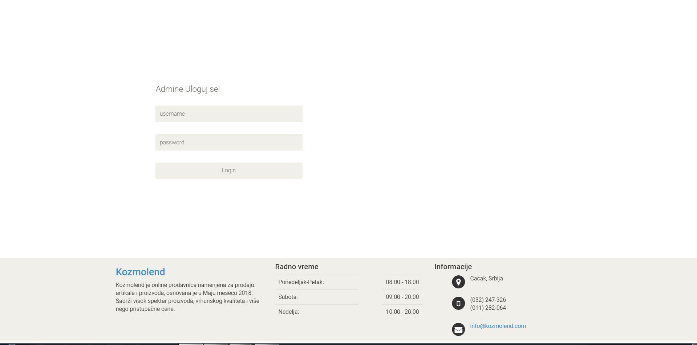	

Admin Home Page:

Admin List Of Orders:
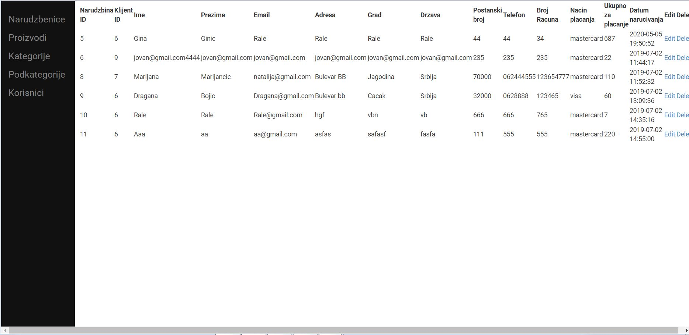
Admin Products:
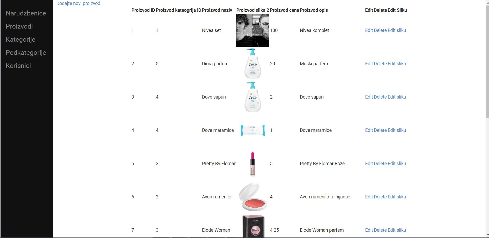
Admin Categories:
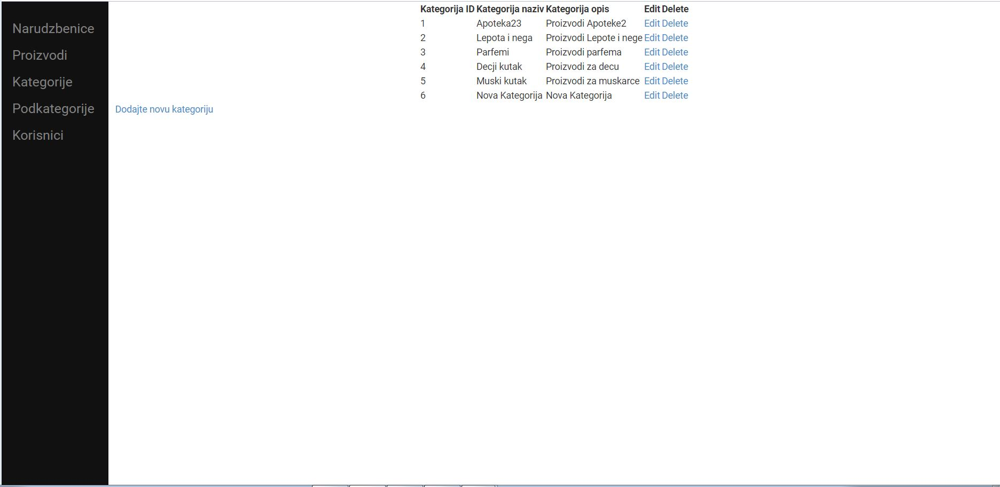
Admin Users:
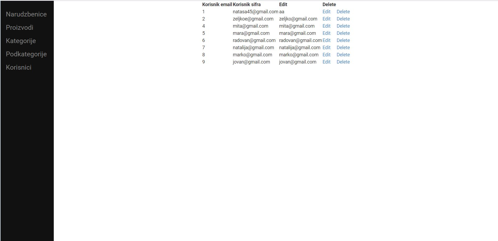

